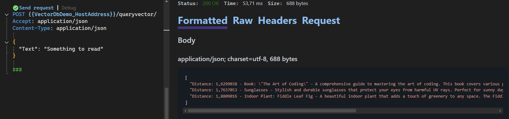
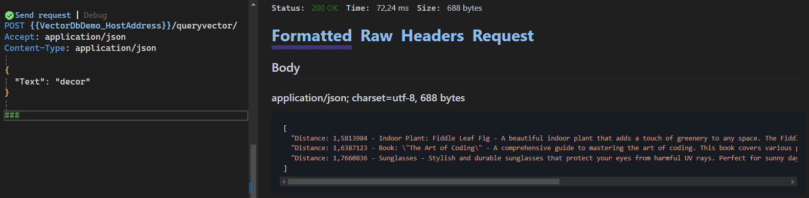
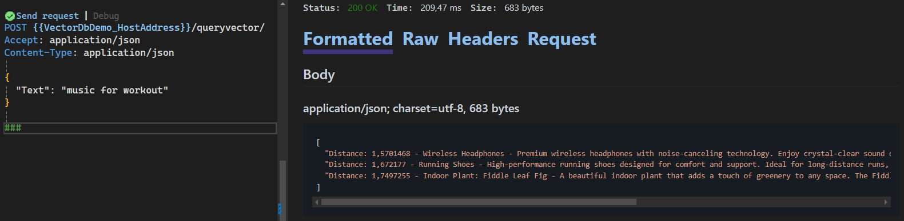

# Vector DB Demo

## Running app locally

### 1. Pull and run chromadb docker container

<code>docker run -p 8000:8000 chromadb/chroma</code>

### 2. Install and pull ollama all-minilm model for vector embeddings. Run in terminal.

<code>ollama pull all-minilm</code>

### 3. Run api locally and use .http file to send requests

## Results

### Search for: Something to read

### Search for: Decor

### Search for: Music for workout

