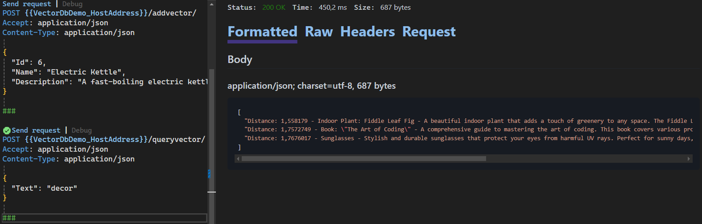

# Vector DB Demo

This project demonstrates the use of a vector database for storing and querying product information. It uses ChromaDB for vector storage and Ollama for generating vector embeddings.

## Prerequisites

- Docker
- .NET 9 SDK
- Ollama CLI

## Running the App Locally

### 1. Pull and run ChromaDB Docker container

<code>docker run -p 8000:8000 chromadb/chroma</code>

### 2. Install and pull Ollama all-minilm model for vector embeddings

<code>ollama pull all-minilm</code>

### 3. Run the API locally

<code>dotnet run --project VectorDbDemo</code>

### 4. Use the `.http` file to send requests

You can use the `VectorDbDemo.http` file to interact with the API endpoints. This file contains predefined HTTP requests for testing the API.

## API Endpoints

### Get ChromaDB Version

<code>GET http://localhost:5073/version/</code>

### Setup Initial Vectors

<code>GET http://localhost:5073/setup/</code>

### Add Product Vector

<code>POST http://localhost:5073/addvector/</code>

### Query Vectors

<code>POST http://localhost:5073/queryvector/  
Content-Type: application/json  
{ "Text": "decor" }
</code>

## Results

### Search for: home appliance

### Search for: decor

## Dependencies

- ChromaDB.Client
- Microsoft.Extensions.AI

## License

This project is licensed under the MIT License.
